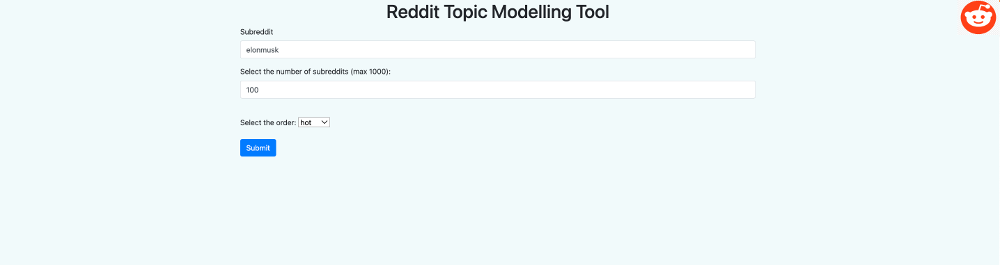

# RedditTopicModellingUI
This repository creates a UI that allows to introduce a subreddit and receive back the topics extracted from a BertTopic transformer:



# How to run it
The easiest way to run the UI is using the Dockerfile. First you need to build the image, passing your environmental variables:

```
docker build -t reddit-app \
--build-arg REDDIT_CLIENT_SECRET=your_client_secret \
--build-arg REDDIT_USERNAME=your_username \
--build-arg REDDIT_PASSWORD=your_password \
--build-arg REDDIT_CLIENT_ID=your_client .
```

The following step is to run the container based on the reddit-app image. Since it is a webapp we need to specify which the connection between docker and localhost ports:

```
docker run -p 8000:8000 -i reddit-app
```
